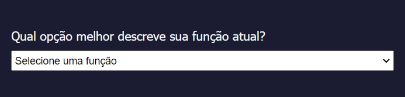

# **Formulário**

Este projeto é um simples cadastro de usuário com algumas informações extras sobre a opinião do usuário com a plataforma. É simples, sem muito estilo aplicado. Porém serve para entender os primeiros passos sobre a estruturação de uma página html.

## Cadastro

A primeira parte é um cadastro simples de informações, três campos input do tipo text que campturam o nome, o endereço e email e a idade do usuário.

## Mais informações

Depois da identificação inicial do usuário o formulário pede uma informação de ocupação, com um campo imput, do tipo select.

Este campo tem as seguintes opções: 

Proximo item do nosso formulário é uma pergunta que testa a satisfação do cliente com a plataforma

Depois de perguntar se você recomendaria o conteúdo da plataforma, que tal perguntar o que voce recomendaria?

E claro, não poderia faltar um cantinho para dar um feedback escrito, uma sugestão do que se pode melhorar. 

Este, é claro, é um projeto introdutório aos primeiros conceitos de estruturação e estilização de uma página web. Um formulário como esse poderia ser bem maior e conter bem mais campos. Poderiamos, com o auxilio de um framwork, como django por exemplo, processar e salvar todas as informações passadas nesses formulário. Poderiamos usar algorítmos de aprendizado de máquina para recomendar-mos conteudo baseados nas respostas dadas pelo usuário. Poderiamos usar algoritmos de processamento de texto para saber o viés da sugestão dada no ultimo campo. Enfim ... 
